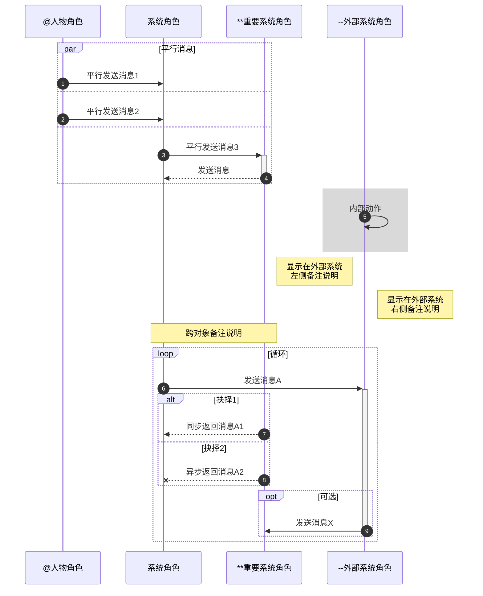

# 看到别人写博客, 我也写写

9月21日上午，阳光明媚，鲜花斗艳。帕洛阿尔托苹果店里欢声笑语，人头攒动。苹果公司首席执行官蒂姆·库克先生在店长欧阳猛南陪同下，不远千米，深入到一线店面，为那里的员工带去节曰的问候和良好的祝愿。

“果粉们，你们辛苦了，我代表某果公司，祝你们身体健康，生活幸福，工作成功！”库克亲切慰问广大员工和顾客，并就iOS7、iPhone 5S和iPhone 5C的销售状况进行调研。

“您现在每月工资有多少？肾5S拿到了吗？”在店里，库克关切地向果粉们问起这一问题。当听说果粉们排到了5S，库克满意地连连点头。接着他指出，近年来苹果事业发展取得巨大成就，特别是iPhone影响剧增，老百姓对iOS满意度逐步提高，在这个转变过程中，果粉的辛勤工作功不可没。

库克看到一个中国小朋友在排队买iPhone 5S，亲切的问：“5288元一台能承受不？”小朋友回答到：“能！”当得知这位小朋友卖了一个肾来买iPhone 5S时，库克叮嘱道：“在支持苹果的同时，也要爱护身体。”

库克与购买苹果手机的果粉们兴致勃勃地参观了苹果专卖店，和员工们拉了拉家常，并饶有兴趣地玩了四盘切西瓜游戏，与普通员工同乐。

在交谈中，库克多次关心地强调：“有了iPhone 5C，就不卖iPhone 5了。”并对顾客说：“好好休息，身体是革命的本钱嘛！”会谈始终在亲切友好的气氛中进行。

顾客们就库克的讲话达成了广泛的共识，并承认世界上只有iOS最流畅，要紧紧的团结在以库克先生为首席执行官的苹果公司集体周围，一心一意抓学习，聚精会神谋发展。

帕洛阿尔托苹果专卖店当日原则通过《蒂姆·库克首席执行官在加州新苹果店的讲话纪要》，并下发各分店认真学习、研讨。

# 测试图表

